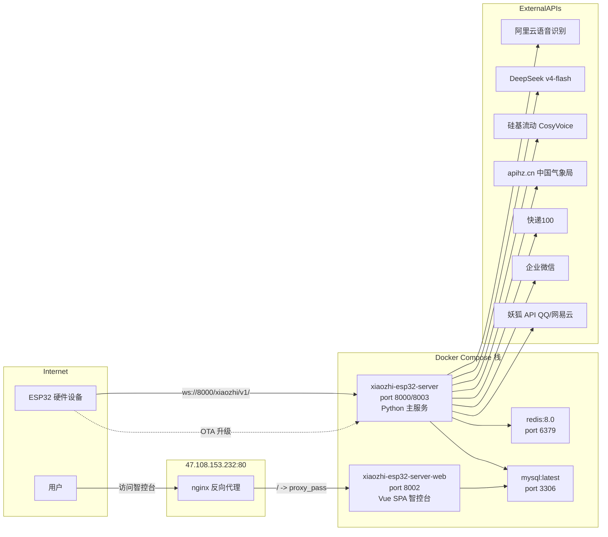
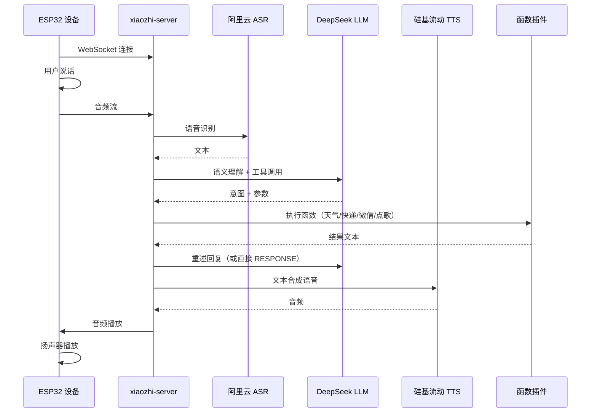

# 架构设计

## 系统概述

[xiaozhi-esp32-server](https://github.com/xinnan-tech/xiaozhi-esp32-server) 是一个为 ESP32 智能硬件提供后端服务的全栈系统。设备通过 WebSocket 长连接与服务端通信，用户语音经过 ASR 识别 → LLM 语义理解 → Intent 函数调用 → TTS 语音合成的完整链路处理后，设备播放语音响应，同时可执行微信消息发送、快递查询、音乐播放、天气查询等实际操作。

系统以 Docker Compose 编排 4 个容器运行，由 nginx 提供域名反向代理，域名通过 [阿里云 DNS](https://dns.console.aliyun.com) 解析。

## 技术栈

**语言与运行时**
- Python 3.x（主服务 xiaozhi-server）
- Vue.js 2.x（智控台前端 SPA）
- JavaScript（Web 前端）

**AI 服务**
- ASR：[阿里云语音识别 (AliyunStreamASR)](https://help.aliyun.com/product/30412.html)
- LLM：[DeepSeek v4-flash](https://platform.deepseek.com/)（OpenAI 兼容 API）
- TTS：[硅基流动 CosyVoice2-0.5B (SiliconFlow)](https://siliconflow.cn/)
- VAD：[SileroVAD](https://github.com/snakers4/silero-vad)（语音活动检测）
- 语音克隆音色：xiaozhi 定制音色

**数据存储**
- MySQL 8.0（主数据库）
- Redis 8.0（缓存/会话）

**基础设施**
- Docker + Docker Compose（容器编排）
- nginx（反向代理）
- [阿里云 ECS](https://ecs.console.aliyun.com) 2 核 2G（主服务器）

**外部 API**
- [中国气象局数据](https://www.cma.gov.cn)（通过 [apihz.cn](https://www.apihz.cn) tqyb.php）
- [快递100](https://www.kuaidi100.com)（物流查询）
- [企业微信机器人](https://developer.work.weixin.qq.com/document/path/91770)（群消息发送）
- [妖狐 API](https://www.yaohud.cn)（QQ音乐/网易云音乐搜索下载）
- [阿里云 DNS](https://dns.console.aliyun.com)（域名解析）

## 部署架构

## 容器结构

| 容器名 | 镜像 | 端口 | 职责 |
|--------|------|------|------|
| xiaozhi-esp32-server | ghcr.nju.edu.cn/xinnan-tech/xiaozhi-esp32-server:server_latest | 8000(WS), 8003(OTA) | Python 主服务，处理语音链路和执行插件 |
| xiaozhi-esp32-server-web | ghcr.nju.edu.cn/xinnan-tech/xiaozhi-esp32-server:web_latest | 8002 | Vue.js 智控台前端 |
| xiaozhi-esp32-server-redis | redis:8.0 | 6379 | 缓存 |
| xiaozhi-esp32-server-db | mysql:latest | 3306 | 数据库 |

## 域名映射

| 域名 | 目标端口 | 后端 |
|------|---------|------|
| xiaozhi.xilingyiyu.cn:80 | 127.0.0.1:8002 | Web (nginx proxy_pass) |
| 8000 端口直通 | docker-proxy | 主服务 WS+HTTP |
| 8003 端口直通 | docker-proxy | OTA + 视觉分析 |

## 意图链路

## 功能清单

| 功能 | 插件文件 | 触发方式 | 外部依赖 |
|------|---------|---------|---------|
| 天气查询 | `get_weather.py` | "天气" / "XX天气" | apihz.cn (中国气象局) |
| 企业微信 | `wechat.py` | "发微信 内容" | 企业微信机器人 webhook |
| 快递查询 | `kuaidi.py` | "查快递 单号" | 快递100 API |
| 点歌播放 | `play_music.py` | "播放 XXX" | 妖狐 API (QQ/网易云) |
| 网络搜索 | `web_search.py` | "搜索 XXX" | 网页搜索引擎 |
| 新闻获取 | `get_news_from_newsnow.py` | "新闻" | newsnow 资讯 |
| 新闻获取 | `get_news_from_chinanews.py` | "中国新闻" | 中国新闻网 |
| 时间查询 | `get_time.py` | "现在几点" | 本地时间 |
| 角色切换 | `change_role.py` | "切换角色" | 内置角色配置 |
| 设备控制 | `call_device.py` | 设备指令 | xiaozhi-server |
| 退出意图 | `handle_exit_intent.py` | 退出对话 | - |

## 关键集成

### 语音链路配置

| 环节 | 选型 | 配置来源 |
|------|------|---------|
| ASR | AliyunStreamASR | appkey + access_key_id + access_key_secret |
| LLM | OpenAILLM → DeepSeek | api_key + base_url + model_name |
| TTS | CosyVoiceSiliconflow | access_token + private_voice (语音克隆) |
| VAD | SileroVAD | 内置模型 |
| Memory | nomem | 无记忆模式 |
| Intent | function_call | 插件自动注册 |

### API 凭据

| 服务 | 凭据位置 | 存储方式 |
|------|---------|---------|
| DeepSeek | 主配置 `.config.yaml` | yaml |
| 阿里云 ASR | 主配置 `.config.yaml` | yaml |
| 硅基流动 TTS | 主配置 `.config.yaml` | yaml |
| apihz 天气 | `get_weather.py` 源码 | 代码常量 |
| 快递100 | `.kuaidi_config.json` | 独立 JSON 文件 |
| 企业微信 | `.wechat_webhook.json` | 独立 JSON 文件 |
| 妖狐音乐 | `.yaohu_config.json` | 独立 JSON 文件 |

## 数据卷映射

| 主机路径 | 容器路径 | 内容 |
|---------|---------|------|
| `./data/` | `/opt/xiaozhi-esp32-server/data/` | 配置文件、设备数据 |
| `./models/SenseVoiceSmall/model.pt` | `/opt/xiaozhi-esp32-server/models/SenseVoiceSmall/model.pt` | 语音模型 |
| `./uploadfile/` | `/uploadfile/` | 上传文件 |

## DNS 解析

所有域名通过 [阿里云 DNS](https://dns.console.aliyun.com) 解析：

| 域名 | 记录类型 | 记录值 |
|------|---------|--------|
| xilingyiyu.cn | A | 47.108.153.232 |
| xiaozhi.xilingyiyu.cn | CNAME | 指向 xilingyiyu.cn |
| video.xilingyiyu.cn | A | 106.55.151.24 |

## 全部域名

| 域名 | 服务器 | 端口 | 服务 |
|------|--------|------|------|
| xiaozhi.xilingyiyu.cn | 47.108.153.232 | 80→8002 | 小智智控台 |
| video.xilingyiyu.cn | 106.55.151.24 | 3000 | 呓语影视 (kvideo) |
| cloudreve 等 | 47.108.178.13 | - | 其他站点 |
