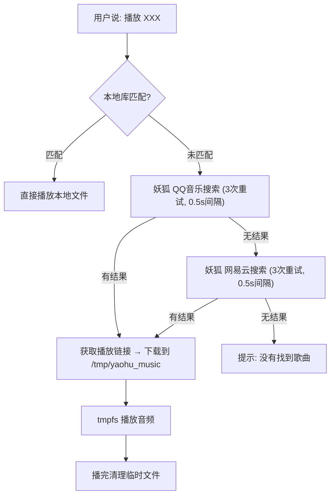

# 自研插件实现

xiaozhi-esp32-server 原生带有新闻、时间、切换角色等基础插件。以下 4 个插件为本项目自研开发，实现了天气查询、微信消息、快递追踪、在线点歌功能。

---

## 天气插件 `get_weather.py`

### 演进历程

| 版本 | 方案 | 问题 |
|------|------|------|
| 1.0 | Moji IP 定位 API | IP 定位不准确，识别到错误城市 |
| 2.0 | apihz.cn `tqyb.php` 中国气象局地址版 | 可行，但用 `REQLLM` 让 LLM 重述会自行加"泸州" |
| **3.0** | **apihz.cn `tqyb.php` + `RESPONSE` 直接播报** | 当前方案 |

### 数据源

- API: `https://cn.apihz.cn/api/tianqi/tqyb.php`
- 数据来自 [中国气象局](https://www.cma.gov.cn)
- 支持 3 天预报 + 预警提醒

### 处理逻辑

```python
# 不传参数 → 默认城市"叙永"
city = location if location else "叙永"

# 请求 3 天预报
resp = requests.get(API_URL, params={"id": ID, "key": KEY, "place": city, "day": 3})
```

### 输出格式

拼接字段：城市名 + 白天/夜间天气 + 气温 + 体感温度 + 最高最低 + 湿度 + 明后天预报 + 预警标题

```
叙永当前天气，白天雷阵雨，夜间雷阵雨，气温28度，体感30度，最高31度，最低24度，湿度75%。明天雷阵雨，22到28度。后天雷阵雨，21到29度。
```

### 关键决策：`RESPONSE` 还是 `REQLLM`

- 最初用 `REQLLM` 把天气文本发给 LLM 重述
- LLM（DeepSeek）知道叙永属于泸州，会在播报时加上"泸州"
- 改为 `Action.RESPONSE` 直接 TTS 播报，精准输出不经过 LLM

---

## 微信插件 `wechat.py`

### 功能

两个函数：

| 函数 | 用途 | 参数 |
|------|------|------|
| `wechat_set_webhook` | 设置企业微信机器人 webhook URL | `webhook_url` |
| `wechat_send` | 发送文本消息到企业微信群 | `content` |

### 架构设计

- webhook URL 独立存储在 `data/.wechat_webhook.json`，不与主配置耦合
- `wechat_set_webhook` 只需设置一次，后续 `wechat_send` 自动读取
- 未设置 webhook 时会提示用户先设置

### 路径计算

webhook 文件路径通过 `__file__` 推导 `project_dir`：

```python
project_dir = os.path.dirname(os.path.dirname(os.path.dirname(os.path.abspath(__file__))))
# plugins_func/functions/wechat.py → plugins_func → xiaozhi-server-root
filepath = os.path.join(project_dir, "data", ".wechat_webhook.json")
```

### API 调用

- 端点: `https://qyapi.weixin.qq.com/cgi-bin/webhook/send?key=<KEY>`
- 方法: POST
- 请求体: `{"msgtype": "text", "text": {"content": "消息内容"}}`
- 成功响应: `{"errcode": 0, "errmsg": "ok"}`

---

## 快递插件 `kuaidi.py`

### 功能

| 函数 | 用途 | 参数 |
|------|------|------|
| `kuaidi_bind` | 绑定快递100 API 账号 | `key`, `customer` |
| `kuaidi_query` | 查询物流轨迹 | `num`（单号）, `com`（公司编码，可选）, `phone`（手机后四位，可选） |

### 签名机制

快递100 实时查询采用 MD5 签名：

```python
param_str = json.dumps({"com": com, "num": num, ...}, separators=(",", ":"))  # 紧凑 JSON
sign = hashlib.md5((param_str + key + customer).encode()).hexdigest().upper()  # 32位大写
```

请求参数使用 `application/x-www-form-urlencoded`：

```
customer=<CUSTOMER>&sign=<SIGN>&param=<COMPACT_JSON>
```

### 自动识别

查询时若不指定 `com`，先调快递100 `auto` 接口识别快递公司。若识别失败（601 未开通套餐），提示用户手动指定。

### 顺丰/中通限制

这两家需要收件人手机号后四位。未提供时会返回 408 错误，插件自动提示。

### 输出格式

- 只取最近 3 条轨迹（简洁版，适合语音播报）
- 显示：签收状态 + 始发地→目的地 + 运输状态 + 预达时间 + 剩余时间 + 最新动态

### 错误处理

| 错误码 | 含义 | 处理 |
|--------|------|------|
| 400 | 找不到快递公司 | 提示确认单号 |
| 408 | 需要手机验证 | 提示提供后四位 |
| 500 | 暂无物流信息 | 提示可能未发货 |
| 601 | 无查询额度 | 提示充值 |

---

## 点歌插件 `play_music.py`

### 功能

支持两种播放模式：

| 模式 | 触发 | 来源 |
|------|------|------|
| 本地播放 | `"random"` 或本地库匹配 | `music_dir` 目录内的 mp3/wav 文件 |
| 在线播放 | 指定歌曲名 | 妖狐 API (QQ音乐 + 网易云) |

### 在线搜歌策略



### 降级策略

1. **QQ音乐优先**：调用 `api.yaohud.cn/api/music/qq`
2. **网易云降级**：QQ无结果或播放链接为空时，调用 `api.yaohud.cn/api/music/wy`
3. **付费/迅雷歌曲**：QQ免费API返回空，网易云可覆盖

### 频控处理

妖狐 API 限制 1秒3次。搜索和获取详情各做 3 次重试，间隔 0.5 秒。

### 文件管理

- 下载到 `tmpfs` (`/tmp/yaohu_music`)，内存文件系统，不占磁盘
- 每次新播放前清理旧文件
- 文件名用歌曲名正则清洗后拼接扩展名

### 关键决策：`RECORD` 还是 `REQLLM`

点歌用 `Action.RECORD`，因为音频直接通过 TTS 流推送，不需要 LLM 再生成文字回复。这与天气不同——天气是纯文字播报，点歌是音频+提示语。
